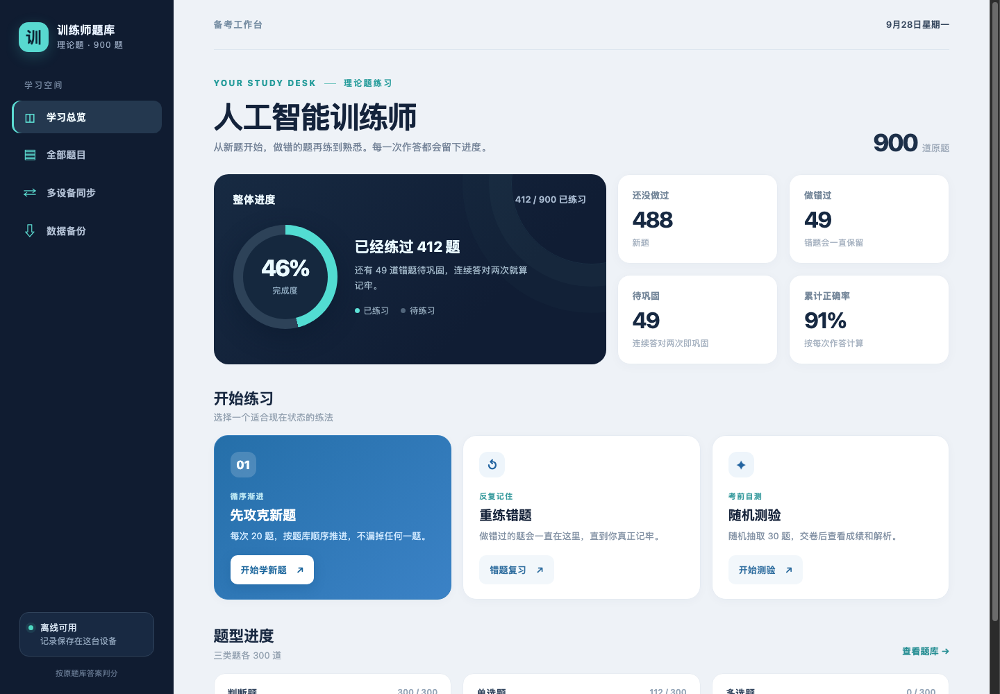
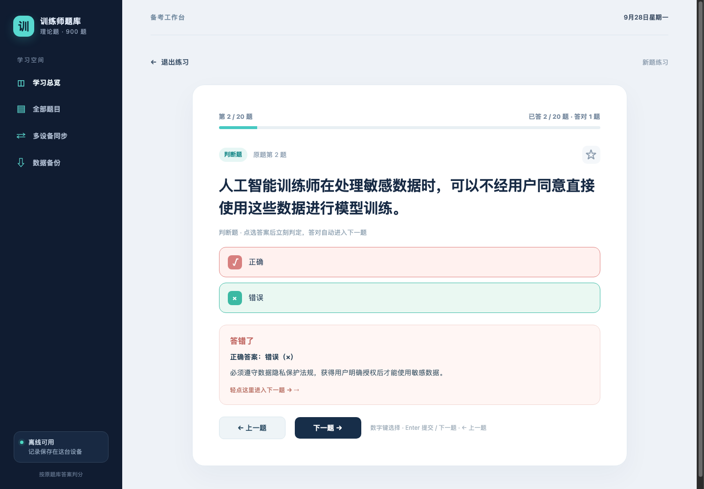
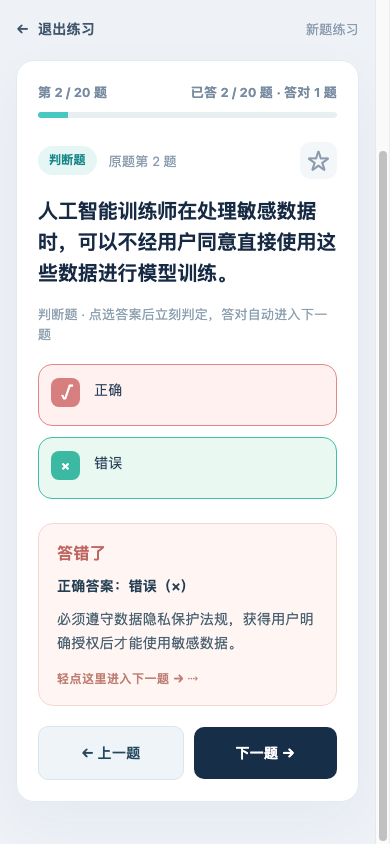

# 人工智能训练师 · 理论题刷题工具

> 900 道理论题，**点一下就知道对错**；Mac 和 iPhone 进度实时互通，断网也能刷。

一个纯前端、零依赖的离线刷题工具。题库共 900 道（判断 / 单选 / 多选各 300），
可以加 iPhone 主屏幕当 App 用，也能部署到 Cloudflare 免费额度上实现多设备同步。



---

## 答题：点一下就有结果

| 场景 | 行为 |
| --- | --- |
| 判断题 / 单选题 | 点选选项**立刻判定**，不用再点「提交」 |
| **答对了** | 绿色高亮闪约 0.7 秒，**自动进入下一题** |
| **答错了** | 立刻弹出正确答案和解析，停在这一题；**轻点解析卡片**即可继续 |
| **回到上一题** | 练习页左下角「← 上一题」，回看时保留你选的选项和解析 |
| 多选题 | 保留「提交答案」（多选没法点一下就判定） |
| 随机测验 | 保留手动提交，交卷后统一揭晓，避免提前泄题 |



## 三种练法

- **先攻克新题** —— 每轮 20 道未做题，按题库顺序推进，不漏题
- **重练错题** —— 做错过的题一直保留，连续答对两次才算巩固
- **随机测验** —— 随机抽 30 题，交卷后给出成绩与本轮错题解析

## 多设备同步

两台设备填**同一个同步码**即可互通：

- 每答完一题，几秒内自动上传
- 每道题按「最近一次作答」合并，收藏按「最近一次收藏」合并
- **两台设备同时做题不会互相覆盖**，服务端和客户端都会校验数据格式
- 换新设备时填同一个同步码，「保存并同步」就能拉回全部进度

## 手机上用

iOS Safari 打开部署后的网址 → 分享 → **添加到主屏幕**，之后就是全屏 App。
Service Worker 会缓存题目，**飞行模式也能继续刷**。

<p align="center">
  
</p>

---

## 快速开始

### 方式一 · 本地直接打开（最简单）

```bash
git clone https://github.com/exder145/ai-trainer-quiz.git
cd ai-trainer-quiz
open index.html          # Windows 直接双击 index.html
```

无需联网、无需安装任何依赖。缺点是跨设备只能靠导出 / 导入 JSON 备份。

### 方式二 · 本地服务器（手机连同一 Wi-Fi 就能用）

```bash
node dev-server.js
```

终端会打印两个地址，手机连同一个 Wi-Fi 打开 `http://192.168.x.x:8787` 即可。
这个服务器直接运行 `worker/index.js`，和线上是**同一份同步代码**，数据存在本地 `.sync-data.json`。

### 方式三 · 部署到公网（推荐）

见 **[部署到公网.md](部署到公网.md)** —— 四条命令、免费、不用买服务器，
之后 iPhone 随时随地都能打开。

---

## 项目结构

```
index.html            页面结构
styles.css            样式（含手机断点与刘海屏安全区适配）
app.js                界面逻辑与答题流程
core.js               进度记录、判分、跨设备合并（纯函数，可单独测试）
sync.js               云同步客户端
questions.js          900 道题库数据
worker/index.js       Cloudflare Worker：静态托管 + /api/state 同步接口
dev-server.js         本地开发服务器（复用上面那个 Worker）
sw.js                 离线缓存
manifest.webmanifest  PWA 配置
wrangler.toml         Cloudflare 部署配置
```

## 同步是怎么工作的

```
  iPhone ─┐
          ├──► 同一个网址 ──► Cloudflare Worker ─┬── 静态文件（题目 / 界面）
  Mac ────┘                                       └── /api/state ──► Workers KV
                                                                          │
                                                                  按同步码分开存放
```

- 静态文件里**不含任何答题记录**
- 答题记录只和同步码绑定，**同步码就是密码**，不要发给别人
- 服务端按每题的 `lastAt` 时间戳合并，后写的旧数据不会覆盖先写的新数据

## 键盘快捷键

| 按键 | 作用 |
| --- | --- |
| `1` ~ `5` | 选择选项 |
| `Enter` | 提交 / 进入下一题 |
| `←` `→` | 上一题 / 下一题 |

## 常见问题

**进度存在哪里？**
每台设备的浏览器 localStorage，以及云端 Cloudflare KV（需要配置同步码）。两者互不依赖。

**会丢进度吗？**
答完一题立刻写入本地，几秒后自动上传云端，另外还有 JSON 导出备份兜底。

**免费额度够用吗？**
够。Cloudflare 免费版每天 10 万次读取、1000 次写入，正常刷题一天也就几十次同步。

**题库来源？**
取自所提供的 Markdown 原题库，答案与解析按原样保留（其中 24 题的原解析为「略」）。

---

仅供个人学习备考使用，题库版权归原作者所有。
